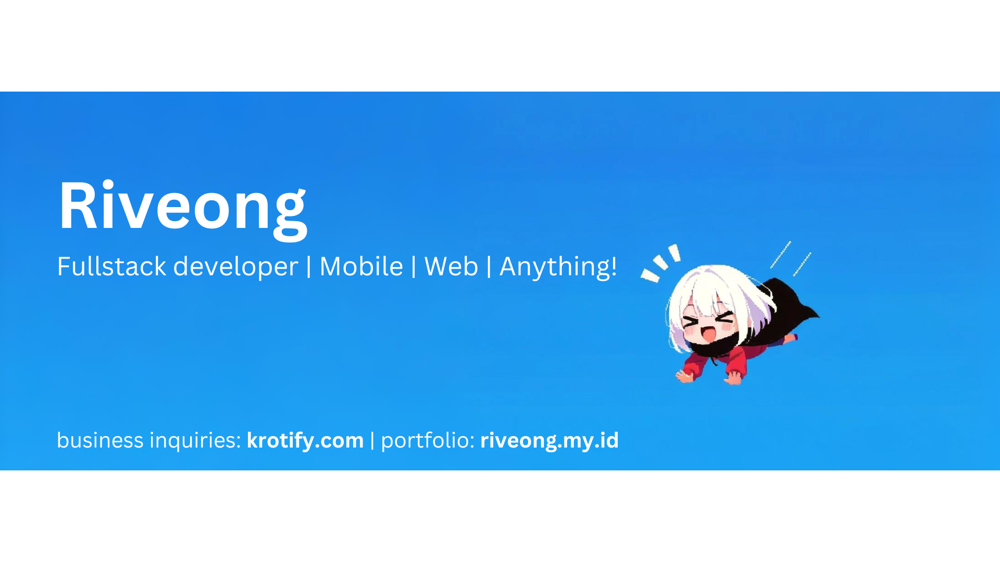

<h1 align="center">Hi there comrades! </h1>

  
  

I am a lover of tech, tea and all its wonders. I marvel at the power of Software Development and the infinite possibilities it offers. I delight in learning new things and expanding my horizons. I cherish writing and art as forms of expression and creativity.

  <table align="center">
    <th>🎮 Game Enthusiast</th>
    <th>💻 Imma reverse engineer this wanna be</th>
    <th>😭 AGILE Method lover</th>
    <td>🕹️ <a href="https://backloggd.com/u/Kinofie/">Games log</a></td>
    <td>📺 <a href="https://www.youtube.com/@Shoulmx">Youtube</a></td>
  </table>

█████████████████████████████████████████████████████████████  <b>Languages/Frameworks: Javascript/Typescript, Kotlin, Java, React, Svelte, Python, RestApi(express, hono, next, fastapi, etc)</b> ████████████████████████████████████████████████████ █████████████████████████████ <b>Visit my <a href="https://riveong.my.id">portfolio</a> pweeasee >~<</b> ███████████ █

